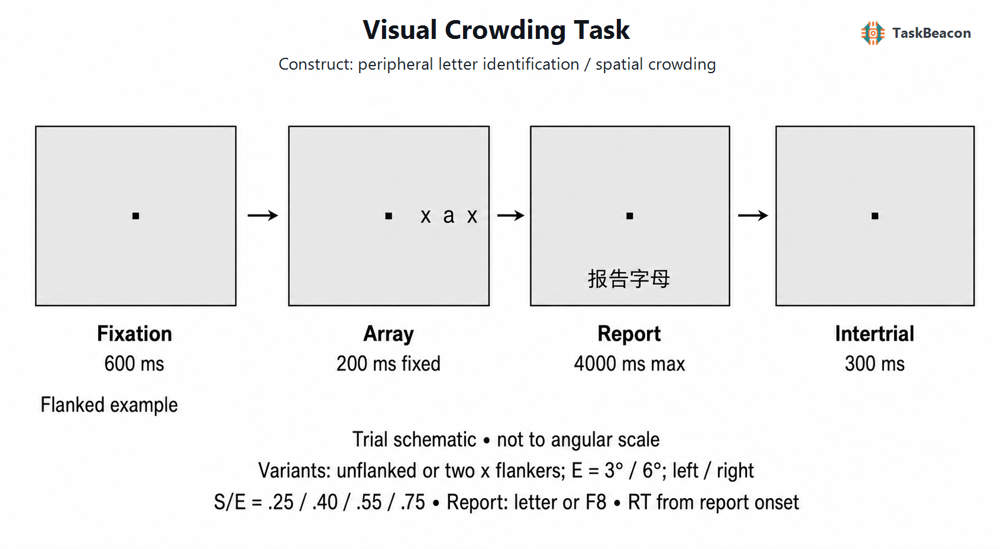

# 视觉拥挤范式：外周物体识别的空间限制、神经基础与测量边界

视觉系统能够检测到外周目标，却可能因邻近物体的存在而无法可靠辨认其身份；这种“可见但难以识别”的分离构成视觉拥挤（visual crowding）的核心测量问题。拥挤限制阅读、搜索及复杂场景中的物体选择，也为区分特征检测、空间整合、知觉组织与注意选择提供了可控范式。视觉拥挤任务通常要求观察者持续中央注视，辨认短暂呈现于外周的目标，并系统改变目标—干扰物间距、偏心度或刺激相似性。由此获得的准确率—间距函数和临界间距，描述的是杂乱环境中的识别限制，不能等同于孤立目标视力、一般反应抑制或 Eriksen flanker 任务所测的反应冲突（Pelli et al., 2004; Whitney & Levi, 2011）。

## 1. 范式提出与理论背景

Bouma（1970）以旁中央字母识别实验指出，使字母获得近似“知觉隔离”所需的邻近间距随目标偏心度增大，经验比例约为偏心度的一半。后来所谓 Bouma 定律将临界间距 (s_c) 概括为偏心度 (E) 的近似线性函数，但比例系数会随视觉方位、刺激材料、准则和测量程序改变；它是需要估计的经验关系，不是固定常数（Coates et al., 2021; Kurzawski et al., 2023a）。Rosen 等（2014）进一步表明，对多部件物体而言，有效间距取决于相关特征部件的位置，单纯以物体中心间距表达会遗漏刺激构型的作用。

Pelli 等（2004）通过检测与辨认、目标与掩蔽物对比度以及间距操控，将拥挤同普通掩蔽区分开来。普通掩蔽主要降低目标特征的可检测性，且通常在空间重叠时最强；拥挤则可在目标仍清晰可见时损害身份判断，并扩展至远大于目标本身的区域。由此，范式的有效性依赖两个条件：孤立目标基线应足以排除单纯视敏度不足，干扰效应应随目标—干扰物间距呈系统变化。早期的“过度特征整合”解释据此把拥挤归因于过大的整合区；后续研究提出强制平均、目标—干扰物替代、位置不确定性、汇总统计表征和注意分辨率限制等解释（Levi, 2008; Whitney & Levi, 2011）。

单一、固定的低级池化过程不足以覆盖全部现象。目标与干扰物的相似性、径向或切向排列、内外侧位置以及更大范围的知觉分组均会改变拥挤；增加元素有时反而使目标从整体构型中分离，形成“去拥挤”。这类结果说明，全局组织能够调节局部干扰，拥挤可能发生在视觉表征的多个阶段（Herzog et al., 2015; Manassi & Whitney, 2018）。近期模型还把偏差与精度联合起来，认为在输入不确定时整合空间上下文可能近似一种利用自然场景冗余的统计策略；该观点解释部分取向判断结果，但不能将所有字母误报归结为最优推断（Cicchini et al., 2022; Schwetlick & Herzog, 2025）。

## 2. 任务逻辑、流程与核心指标

经典试次先建立中央注视，再在预定偏心度短暂呈现目标。目标可单独出现，也可被一个或多个干扰物包围；字母范式通常要求报告中央目标的身份。目标消失后再收集反应，可减少按键准备对短暂阵列呈现的影响。练习阶段可提供正确性反馈，正式测量多不提供逐试次反馈，以免反馈改变决策策略；具体做法并非范式定义的一部分。实验应以视角而非像素描述字形大小、偏心度和中心间距，并以头部固定、眼动监测或经过验证的注视程序约束实际视网膜位置（Pelli et al., 2004; Kurzawski et al., 2023b）。

核心对比包括“有干扰物—无干扰物”、近间距—远间距，以及不同偏心度或排列方向之间的函数差异。无干扰物准确率反映该位置上孤立目标是否可辨；有干扰物准确率相对下降才构成拥挤效应。临界间距通常由多级间距上的心理测量函数估计，即达到预设正确率所需的最小中心间距。恒定刺激法便于比较完整函数，自适应阶梯或贝叶斯程序则把试次集中在阈值附近；若只采若干固定间距而不拟合函数，结果应报告为条件准确率，不能称为已测得临界间距（Coates et al., 2021）。

阵列阶段主要操控目标与邻近信息的空间整合及分组；“近间距有干扰物 > 远间距有干扰物”的错误率对比同时受相似性、位置不确定性和注意分配影响。报告阶段读取知觉表征并加入记忆与反应选择成分，因而报告反应时不是阵列阶段加工速度的纯指标。若记录完整错误类型，目标特征向干扰物特征偏移提示同化，直接报告干扰物则提示替代；二者可以并存（Kalpadakis-Smith et al., 2022）。内侧与外侧干扰物贡献不对称、径向干扰强于切向干扰等现象还表明，一个总准确率不足以识别具体计算过程。

## 3. 主要行为与神经科学证据

### 3.1 行为规律与知觉组织

跨材料研究较一致地发现，临界间距随偏心度增加，且间距比绝对字形大小更能预测外周识别失败（Bouma, 1970; Pelli et al., 2004）。但“约半个偏心度”只是常见数量级。Coates 等（2021）对不同时期视标研究的重分析显示，刺激定义和测量方式会改变估计值；Kurzawski 等（2023a）在 50 名观察者和多个偏心度上以两参数 Bouma 模型解释了大部分交叉验证方差，同时观察到稳定的个体差异。这一结果支持比例关系作为紧凑描述，并不排除方位、材料或个体对斜率和截距的调节。

干扰强度还取决于局部相似性和整体分组。与目标相似、沿径向排列并位于更外侧的干扰物通常造成更强损害；若干扰物彼此形成独立整体，目标—干扰分组减弱，表现可能恢复（Herzog et al., 2015）。因此，“有无干扰物”对比不只改变元素数量，也同时改变整体构型。实验若要把差异解释为局部空间整合，应匹配目标可见性、刺激能量与任务难度，并操控或统计控制分组线索。多阶段观点能够解释为何目标局部身份报告失败时，某些整体或类别信息仍可影响后续加工，但这些间接效应不证明被试对目标具有可报告的意识表征（Manassi & Whitney, 2018）。

### 3.2 fMRI、EEG 与神经群体编码

功能磁共振成像（functional magnetic resonance imaging, fMRI）研究对拥挤的单一皮层定位并未形成一致结论。Anderson 等（2012）发现，拥挤导致的外观变化与早期视觉皮层适应信号及更高级腹侧视觉区活动有关；Millin 等（2014）则在保持时间结构一致的字母条件下观察到从 V1 至 hV4 的血氧水平依赖（blood-oxygen-level-dependent, BOLD）信号抑制，其中 V1/V2 效应在注意转离刺激时仍存在。不同结果部分源自是否空间分离目标与干扰物反应、拥挤强度和注意任务的差异。BOLD 条件差异说明多个视觉区参与，不能单独确定信息损失的起点或因果方向。

事件相关电位（event-related potential, ERP）为时间进程提供补充。使用游标—线段分组操控时，早期 P1 主要追踪刺激物理属性，拥挤差异在约 180 ms 后的 N1 抑制中出现，并涉及较高级视觉区的源估计（Chicherov et al., 2014）。经典字母拥挤研究同样报告较晚 ERP 与振荡活动差异，支持大尺度交互在身份不可辨认中的作用（Ronconi et al., 2016）。头皮 EEG 的源定位精度有限，这些结果支持“晚于初始视觉响应的差异”，不否认早期皮层已发生上下文调制。

近年的神经群体记录进一步缩小了测量尺度。Henry 与 Kohn（2022）在清醒猕猴同时记录 V1 和 V4，发现干扰物降低两区关于目标取向的信息，V4 的损失更大且跨越更宽间距；Kim 与 Pasupathy（2024）则显示 V4 形状选择性随干扰物数量、距离和目标显著性系统改变。人类个体差异研究发现，可无拥挤容纳的字母数与 V4 视网膜拓扑图表面积相关，而与 V1—V3 表面积无显著关系（Kurzawski et al., 2025）。上述证据共同支持从早期上下文调制到中级物体表征的分布式过程。动物被动注视、取向或形状刺激与人类字母辨认仍有任务差异；皮层相关也尚不能证明 V4 是唯一生成拥挤的部位。

## 4. 范式发展与主要应用

视觉拥挤已由成人正常外周视觉扩展至发育与临床研究。儿童中央视觉和斜视性弱视的拥挤范围可能扩大，但相同的总错误率可以由不同的同化、替代与随机误报组合产生。Kalpadakis-Smith 等（2022）以连续特征报告表明，正常外周、发育中视觉与弱视均出现系统性外观偏差，同时各群体的错误构成并不完全相同。因此，群体差异有助于检验整合与选择理论，却不能直接转化为个体诊断或把异常归因于单一神经阶段。

方法学发展正在扩大远程测量的可行性。Kurzawski 等（2023b）的 EasyEyes 研究以动态光标追踪约束在线注视，在 12 名观察者中得到与实验室眼动控制条件相近的阈值；各方法内重测相关为中等水平，且第二次测量普遍略低于第一次。该结果说明训练或顺序效应不可忽略，也说明未经验证的中央注视指令不足以替代注视控制。临床或大样本应用还需建立设备校准、年龄分层常模、重测间隔和异常值规则，避免把实验内稳定的群体效应误作高精度个体生物标志物。

## 5. 测量效度与解释边界

拥挤效应具有明确的操作效度：目标在孤立条件可辨认，邻近干扰物在特定空间范围内降低身份判断，且效应随间距变化。构念效度则取决于控制。孤立基线不足会把视敏度或对比敏感度缺陷混入拥挤；目标过小、干扰物重叠或低对比条件可能引入普通掩蔽；注视偏移会同时改变实际偏心度和间距比。固定暴露时长还可能混入时间整合、注意转移与眼跳准备。字母、取向、面孔和多部件物体的结果不能在没有刺激匹配时直接互换（Levi, 2008; Schwetlick & Herzog, 2025）。

个体水平测量应优先拟合多间距心理测量函数并报告不确定性，而非只用“拥挤—不拥挤”差值。Kurzawski 等（2023a, 2023b）的结果支持临界间距具有可重复个体差异，但也显示练习、注视方法和实验环境会改变估计。可靠性还受每个空间单元试次数、错误处理、函数模型和阈值准则影响。研究设计应预注册主要空间对比，分别报告遗漏、注视违规和有效试次，并将群体平均的稳健性与个体排序的信度分开评估。

## 6. TaskBeacon 中的任务实现

### 6.1 任务资源与访问入口

| 资源 | ID | 用途 | 地址 |
|---|---|---|---|
| Python 完整实验实现 | T000133 | 本地行为实验与数据采集 | <https://github.com/TaskBeacon/T000133-visual-crowding-task> |
| 浏览器派生源码 | H000133 | 行为型网页预览的源码 | <https://github.com/TaskBeacon/H000133-visual-crowding-task> |
| 公共运行入口 | H000133 | 在线体验浏览器预览 | <https://taskbeacon.github.io/psyflow-web/?task=H000133-visual-crowding-task> |

H000133 保留主要条件与时序，但浏览器 CSS 像素、设备显示特性和无硬件眼动监测的条件不同于本地研究采集；该入口适合体验与行为预览，不能替代经物理标定的实验室版本。

### 6.2 实现流程与关键参数

TaskBeacon 当前版本采用固定全因子设计：偏心度为 3° 或 6°，目标位于左或右视野，条件包括无干扰物及中心间距为偏心度 0.25、0.40、0.55、0.75 倍的两侧径向 `x` 干扰。25 个小写英文字母（排除 `x`）各进入全部空间条件，共 500 试次，分为 5 组、每组 100 试次；完整计划先随机化再分组。字形 x 高标称为 0.50°，实现依据操作者填写的屏幕可见尺寸与眼屏距离换算视角。任务不使用自适应控制器，也不拟合临界间距；主要结果是各空间单元准确率、遗漏和自报注视偏离。

**图 1. TaskBeacon 当前视觉拥挤试次。** 中央黑色注视方块呈现 600 ms；随后目标字母在左或右侧 3°/6°偏心位置呈现 200 ms，无干扰条件仅呈现目标，有干扰条件在目标径向内外两侧同时呈现 `x`，中心间距分别为偏心度的 0.25、0.40、0.55 或 0.75 倍。阵列阶段不接收反应；目标消失后进入最长 4000 ms 的报告阶段，按目标小写字母键结束该阶段，按 F8 表示自报注视偏离，超时记为遗漏。随后为 300 ms 注视间隔。任务不提供正确性反馈；F8 试次从准确率分母排除。所有条件按固定全因子计划呈现，无阶梯或其他自适应调整。

报告反应时从报告屏出现开始，因而不应解释为刺激出现后的总识别时长。F8 是自我报告，不能检测未报告的眼跳；现有仓库也未提供人体验证数据。该实现适合估计固定间距下的准确率—间距形态，研究解释必须同时检查无干扰基线，并将屏幕物理标定、真实注视和显示时延作为实验控制，而非软件记录已解决的条件。

## 参考文献

Anderson, E. J., Dakin, S. C., Schwarzkopf, D. S., Rees, G., & Greenwood, J. A. (2012). The neural correlates of crowding-induced changes in appearance. *Current Biology, 22*(13), 1199–1206. https://doi.org/10.1016/j.cub.2012.04.063

Bouma, H. (1970). Interaction effects in parafoveal letter recognition. *Nature, 226*(5241), 177–178. https://doi.org/10.1038/226177a0

Chicherov, V., Plomp, G., & Herzog, M. H. (2014). Neural correlates of visual crowding. *NeuroImage, 93*, 23–31. https://doi.org/10.1016/j.neuroimage.2014.02.021

Cicchini, G. M., D’Errico, G., & Burr, D. C. (2022). Crowding results from optimal integration of visual targets with contextual information. *Nature Communications, 13*, Article 5741. https://doi.org/10.1038/s41467-022-33508-1

Coates, D. R., Ludowici, C. J. H., & Chung, S. T. L. (2021). The generality of the critical spacing for crowded optotypes: From Bouma to the 21st century. *Journal of Vision, 21*(11), Article 18. https://doi.org/10.1167/jov.21.11.18

Henry, C. A., & Kohn, A. (2022). Feature representation under crowding in macaque V1 and V4 neuronal populations. *Current Biology, 32*(23), 5126–5137.e3. https://doi.org/10.1016/j.cub.2022.10.049

Herzog, M. H., Sayim, B., Chicherov, V., & Manassi, M. (2015). Crowding, grouping, and object recognition: A matter of appearance. *Journal of Vision, 15*(6), Article 5. https://doi.org/10.1167/15.6.5

Kalpadakis-Smith, A. V., Tailor, V. K., Dahlmann-Noor, A. H., & Greenwood, J. A. (2022). Crowding changes appearance systematically in peripheral, amblyopic, and developing vision. *Journal of Vision, 22*(6), Article 3. https://doi.org/10.1167/jov.22.6.3

Kim, T., & Pasupathy, A. (2024). Neural correlates of crowding in macaque area V4. *The Journal of Neuroscience, 44*(24), e2260232024. https://doi.org/10.1523/JNEUROSCI.2260-23.2024

Kurzawski, J. W., Burchell, A., Thapa, D., Winawer, J., Majaj, N. J., & Pelli, D. G. (2023a). The Bouma law accounts for crowding in 50 observers. *Journal of Vision, 23*(8), Article 6. https://doi.org/10.1167/jov.23.8.6

Kurzawski, J. W., Pombo, M., Burchell, A., Hanning, N. M., Liao, S., Majaj, N. J., & Pelli, D. G. (2023b). EasyEyes—A new method for accurate fixation in online vision testing. *Frontiers in Human Neuroscience, 17*, Article 1255465. https://doi.org/10.3389/fnhum.2023.1255465

Kurzawski, J. W., Qiu, B. S., Majaj, N. J., Benson, N. C., Pelli, D. G., & Winawer, J. (2025). Human V4 size predicts crowding distance. *Nature Communications, 16*(1), Article 3876. https://doi.org/10.1038/s41467-025-59101-w

Levi, D. M. (2008). Crowding—An essential bottleneck for object recognition: A mini-review. *Vision Research, 48*(5), 635–654. https://doi.org/10.1016/j.visres.2007.12.009

Manassi, M., & Whitney, D. (2018). Multi-level crowding and the paradox of object recognition in clutter. *Current Biology, 28*(3), R127–R133. https://doi.org/10.1016/j.cub.2017.12.051

Millin, R., Arman, A. C., Chung, S. T. L., & Tjan, B. S. (2014). Visual crowding in V1. *Cerebral Cortex, 24*(12), 3107–3115. https://doi.org/10.1093/cercor/bht159

Pelli, D. G., Palomares, M., & Majaj, N. J. (2004). Crowding is unlike ordinary masking: Distinguishing feature integration from detection. *Journal of Vision, 4*(12), 1136–1169. https://doi.org/10.1167/4.12.12

Ronconi, L., Bertoni, S., & Bellacosa Marotti, R. (2016). The neural origins of visual crowding as revealed by event-related potentials and oscillatory dynamics. *Cortex, 79*, 87–98. https://doi.org/10.1016/j.cortex.2016.03.005

Rosen, S., Chakravarthi, R., & Pelli, D. G. (2014). The Bouma law of crowding, revised: Critical spacing is equal across parts, not objects. *Journal of Vision, 14*(6), Article 10. https://doi.org/10.1167/14.6.10

Schwetlick, L., & Herzog, M. H. (2025). Visual crowding. *Annual Review of Vision Science, 11*(1), 359–383. https://doi.org/10.1146/annurev-vision-110423-024409

Whitney, D., & Levi, D. M. (2011). Visual crowding: A fundamental limit on conscious perception and object recognition. *Trends in Cognitive Sciences, 15*(4), 160–168. https://doi.org/10.1016/j.tics.2011.02.005
